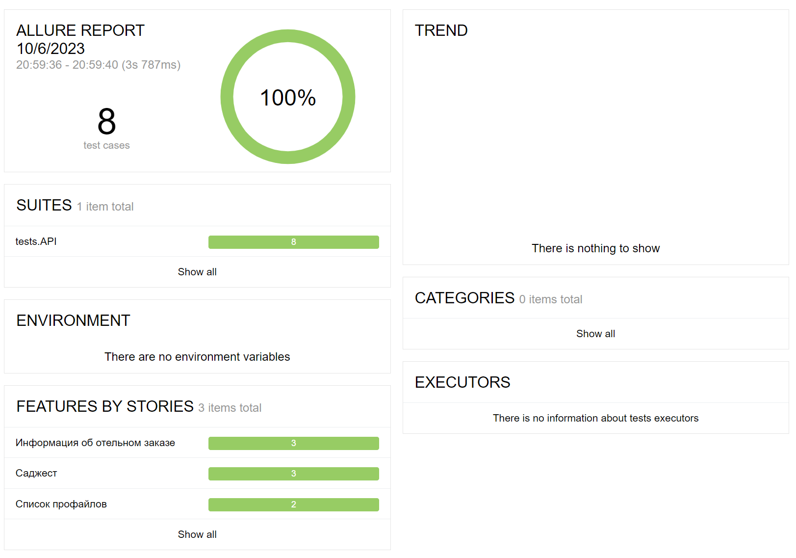
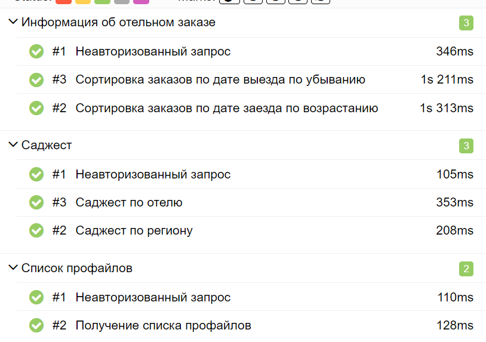

## Пример организации кода API-автотестов для тестирования сайта бронирований b2b.ostrovok.ru

## Реализованные сценарии:

* Проверка неавторизованного доступа
* Получение информации об отельных заказах
* Проверка сортировки заказов по дате заезда/выезда
* Проверка списка профайлов
* Проверка работы автозаполнения по региону/отелю

## Применяемые технологии

<table>
    <tr>
        <td></td>
        <td>Pycharm</td>
    </tr>
    <tr>
        <td></td>
        <td>Python</td>
    </tr>
    <tr>
        <td></td>
        <td>Pytest</td>
    </tr>
    <tr>
        <td></td>
        <td>Requests</td>
    </tr>
    <tr>
        <td></td>
        <td>Allure</td>
    </tr>
</table>

## Запуск

1. Для доступа к API нужно получить ключ и подставить его в значение переменной B2B_API_KEY в файле .env.example. 
2. Файл .env.example переименовать в .env
3. Создать локальное окружение и активировать его:
```bash
python -m venv .venv
source .venv/bin/activate
```
4. Установить зависимости:
```bash
pip install -r requirements.txt
```
5. Запустить тесты:
```bash
pytest .
```

## Скриншоты Allure-отчета


